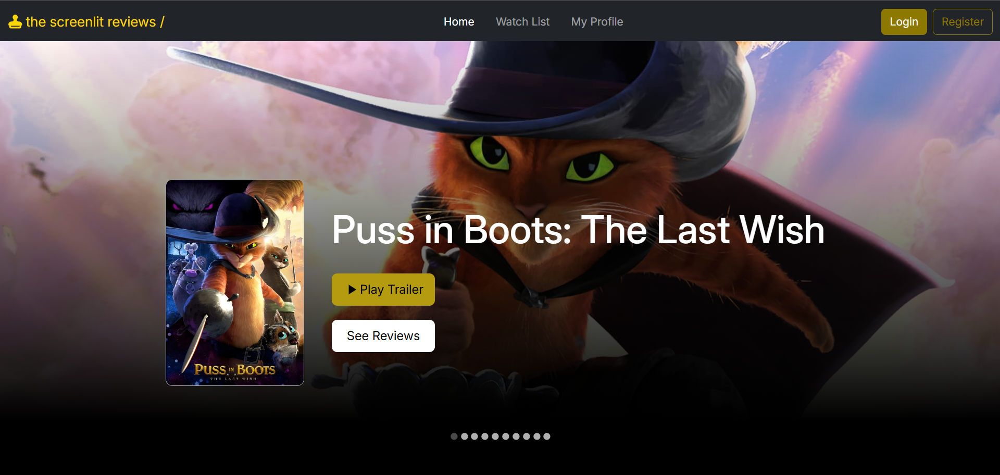
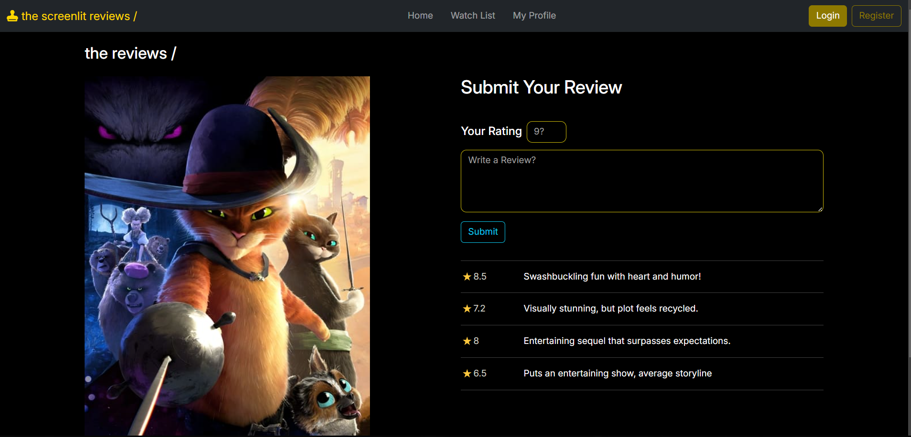
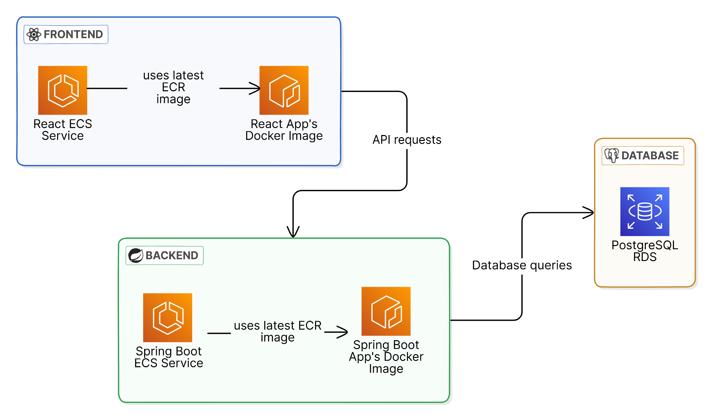

# Screenlit - Movie Review Platform

Screenlit is a full-stack web application deployed on AWS. The application consists of a React frontend and a Spring Boot backend, with a PostgreSQL database hosted on Amazon RDS. The entire system is containerized using Docker and deployed on AWS using ECS and Fargate for scalable and managed services.




## Features ⚡

- Browse movies and watch their trailers
- Read reviews and ratings from other users
- Share your own reviews and ratings for movies

## Tech Stack 🔨

[](#) 


## Deployment on AWS

### Architecture Overview



### 0. Prerequisites
   - AWS CLI, Docker, AWS Account


### 1. Amazon RDS (PostgreSQL Database)
   - **Instance Class**: `db.t4g.micro`

   - **Engine**: PostgreSQL

   - The database is hosted on Amazon RDS, which ensures scalability, security, and durability for the application’s data storage needs.

   - After hosting the database on RDS, it provided a database endpoint URL of the format `<db-identifier>.<your-region>.rds.amazonaws.com`.

### 2. Backend (Spring Boot)

   - **Containerization**: The Docker image for the React app was built using a Dockerfile. After building, the image was tagged and pushed to Amazon ECR for storage.
  
   ```
   docker build -t screenlit-backend .
   ```
   ```
   docker tag screenlit-backend:latest <aws_account_id>.dkr.ecr.<region>.amazonaws.com/screenlit-backend:latest
   ```
   ```
   docker push <aws_account_id>.dkr.ecr.<region>.amazonaws.com/screenlit-backend:latest
   ```

   - **Image Storage**: Amazon ECR (Elastic Container Registry)

   - **ECS Service**: Both the backend and frontend are deployed as separate services within the same ECS cluster. The backend service is named `slit-backend-service` and uses the `slit-backend-taskdef` task definition.
   - **Task Definition**: The task definition for the backend specifies:
      - **CPU**: 0.5 vCPU
      - **Memory**: 1 GB
      - **Operating System/Architecture**: Linux/X86_64
   
   - **Public IP**: The backend service receives a public IP, which the frontend uses for API requests.
   
   - **Database Connection**: The database endpoint, port, username, and password are passed as environment variables in the task definition to connect the Spring Boot application to the database.


### 3. Frontend (React App)
   - **Containerization**: The Docker image for the React app was built using a Dockerfile. After building, the image was tagged and pushed to Amazon ECR for storage.
  
   ```
   docker build -t screenlit-frontend .
   ```
   ```
   docker tag screenlit-frontend:latest <aws_account_id>.dkr.ecr.<region>.amazonaws.com/screenlit-frontend:latest
   ```
   ```
   docker push <aws_account_id>.dkr.ecr.<region>.amazonaws.com/screenlit-frontend:latest
   ```
   
   - **Image Storage**: Amazon ECR

   - **ECS Service**: The frontend service `slit-frontend-service` is deployed on the same ECS cluster and uses the `slit-frontend-taskdef` task definition
   - **Task Definition**: The task definition for the frontend specifies:
      - **CPU**: 0.25 vCPU
      - **Memory**: 0.5 GB
      - **Operating System/Architecture**: Linux/X86_64

   - **Backend API**: The frontend communicates with the backend via the backend service’s `slit-backend-service` public IP which is stored as a enviornment variable in the frontend task definition.

### 4. Accessing the Application
- Once the frontend and backend are deployed, the application will be accessible via the public IP of the frontend ECS service.

## Conclusion

This deployment utilizes AWS services like ECS, Fargate, ECR, and RDS to create a scalable, managed, and containerized full-stack application.
